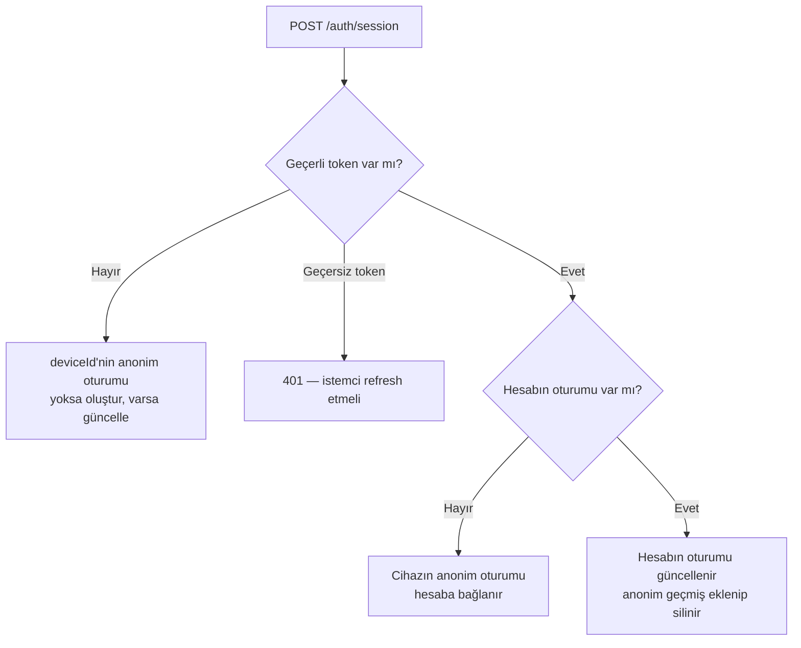

# auth-lib

[](https://jitpack.io/#Furkanaksu/auth-lib)

Ktor + Exposed tabanlı, **yeniden kullanılabilir oturum ve hesap kütüphanesi**.
Her projede bağımlılık olarak eklenir, üç satırla çalışır.

- **Cihaz oturumu** — giriş olmadan: uygulama her açıldığında `deviceId` ile upsert.
- **Hesap** — email + şifre ile kayıt/giriş, access + refresh token.
- Giriş yapılmışsa oturum **hesaba** bağlanır; cihazın o ana kadarki anonim geçmişi hesaba devredilir.

Kütüphanede admin ile ilgili hiçbir şey yok; admin paneli projede kalır.

Altyapı `furkan.api` ve `support-lib` ile aynıdır: JDK 21, Kotlin 2.2.21, Ktor 3.3.2, Exposed 0.61.0.

## Kurulum

`settings.gradle.kts`:

```kotlin
dependencyResolutionManagement {
    repositories {
        mavenCentral()
        maven("https://jitpack.io")
    }
}
```

`build.gradle.kts`:

```kotlin
implementation("com.github.Furkanaksu:auth-lib:1.2.0")
```

## Kullanım

```kotlin
fun Application.module() {
    val db = Database.connect(/* projenin kendi DB'si */)
    install(ContentNegotiation) { json() }

    val auth = AuthConfig(
        database = db,
        jwtSecret = System.getenv("AUTH_JWT_SECRET"),  // en az 32 karakter
        tablePrefix = "prayapp_"                        // prayapp_accounts, prayapp_sessions...
    )
    auth.migrate()

    routing {
        authRoutes(auth)

        // Kendi route'larını korumak:
        authenticate(AUTH_LIB) {
            get("/profil") { call.respond(call.currentAccount()!!) }
        }
    }
}
```

JWT provider'ı `authRoutes` kendisi kaydeder; ayrıca `install(Authentication)` gerekmez.
Kendi korumalı route'larını `authRoutes`'tan **önce** tanımlıyorsan en başta `installAuthLib(auth)` çağır.

## Uç noktalar

`basePath` varsayılanı `/auth`:

| Metot | Yol | Token | Açıklama |
| --- | --- | --- | --- |
| POST | `/auth/session` | opsiyonel | Oturum upsert — token varsa hesaba, yoksa `deviceId`'ye |
| POST | `/auth/register` | — | Hesap aç → token çifti |
| POST | `/auth/login` | — | Giriş → token çifti |
| POST | `/auth/refresh` | — | Refresh token'la yeni çift (eskisi iptal) |
| GET | `/auth/me` | zorunlu | Hesap + hesaba bağlı oturum |

## Kod uzerinden kullanim (kendi uclarini korumak)

Mevcut uclarini ve cevap seklini degistirmek istemiyorsan, HTTP ucu yerine oturum mantigini
dogrudan cagirabilirsin:

```kotlin
val sessions = AuthSessions(auth)
val session = sessions.upsert(SessionRequest(deviceId = deviceId, platform = platform))
// ...sonra kendi cevap modeline cevir
```

`upsert` hesaba devretmeyi, `metadata` birlestirmeyi ve acilis sayacini halleder. Okuma tarafinda
`sessions.findByDevice(...)` / `findByAccount(...)` kullanabilir ya da dogrudan `auth.sessions`
tablosu uzerinde kendi Exposed sorgularini yazabilirsin.

## Oturum

Uygulama her açılışta çağırır. Sadece `deviceId` zorunlu:

```json
{
  "deviceId": "a1b2c3",
  "platform": "android",
  "appVersion": "2.3.0",
  "appName": "prayapp",
  "language": "tr",
  "city": "Istanbul",
  "latitude": 41.0082,
  "longitude": 28.9784,
  "metadata": { "isPremium": true, "locationPermission": true }
}
```

- Gönderilmeyen alan eski değerini korur; `metadata` anahtar bazında birleştirilir.
- Mevcut istemcilerle uyum: `app_version` / `app_name` adları ve tırnaklı koordinat (`"41.0082"`) da kabul edilir.
- Uygulamaya özel her şey (premium, izinler, tema...) `metadata`'ya gider; tabloya kolon eklemek gerekmez.

### Oturum kime ait?



Hesap başına tek oturum tutulur; kullanıcı başka cihazdan girerse `deviceId` son kullanılan cihaz olur.

## Hesap

```json
POST /auth/register   { "email": "a@b.com", "password": "en-az-8-karakter", "displayName": "Ali" }
POST /auth/login      { "email": "a@b.com", "password": "..." }
POST /auth/refresh    { "refreshToken": "..." }
```

Cevap:

```json
{
  "accessToken": "eyJ...",
  "refreshToken": "q9Z...",
  "tokenType": "Bearer",
  "expiresIn": 3600,
  "account": { "id": 1, "email": "a@b.com", "displayName": "Ali", "createdAt": "..." }
}
```

İstemci akışı: token'ı `Authorization: Bearer <accessToken>` header'ında gönder; 401 alınca
`/auth/refresh` ile yenile; refresh de 401 dönerse kullanıcıyı giriş ekranına al.

Çıkış istemcide yapılır: uygulama token'ları siler. Sunucu tarafında çıkış ucu yoktur; refresh token
süresi (varsayılan 30 gün) dolana kadar geçerli kalır.

## Güvenlik

- Şifreler PBKDF2-HMAC-SHA256 (310.000 iterasyon, rastgele tuz) ile saklanır; karşılaştırma sabit zamanlı.
- Access token imzalı JWT (varsayılan 1 saat). Refresh token rastgele ve opak (varsayılan 30 gün); DB'de sadece SHA-256 özeti tutulur.
- Refresh her kullanımda döner. İptal edilmiş bir refresh token tekrar gelirse token çalınmış sayılır ve hesabın **tüm** refresh token'ları iptal edilir.
- Yanlış şifre ve kayıtlı olmayan email aynı hatayı ve aynı süreyi verir; email'in kayıtlı olup olmadığı anlaşılmaz.
- `AuthConfig.toString()` secret'ı yazdırmaz.

## Ayarlar

| Alan | Varsayılan | Açıklama |
| --- | --- | --- |
| `database` | — | Projenin Exposed `Database`'i |
| `jwtSecret` | — | En az 32 karakter |
| `basePath` | `/auth` | |
| `tablePrefix` | `""` | Aynı DB'de birden fazla uygulama için |
| `authName` | `auth-lib` | `authenticate(...)` ile kullanılan provider adı |
| `accessTokenTtl` | 1 saat | |
| `refreshTokenTtl` | 30 gün | |
| `minPasswordLength` | 8 | |

## Tablolar

`migrate()` üç tablo oluşturur: `<prefix>accounts`, `<prefix>sessions`, `<prefix>refresh_tokens`.
Hesap silinirse oturumu anonim kalır (`SET NULL`), refresh token'ları silinir (`CASCADE`).

## Yayınlama (JitPack)

```bash
git tag 1.2.0
git push origin 1.2.0
```

## Geliştirme

```bash
./gradlew build
```
